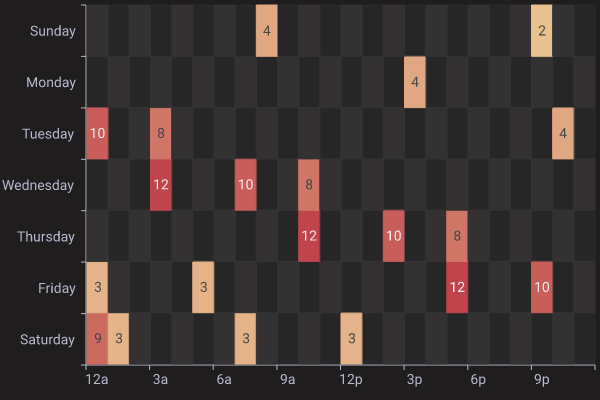
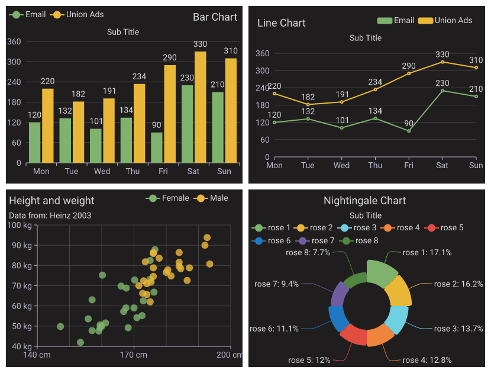

# charts-rs

`charts-rs` 是纯rust实现的图表库，使用简单而且性能高效，生成svg低于10ms，而png也低于50ms，便于在各种无法直接渲染svg的场景下使用，现已支持更多的图片格式，如：jpeg，webp，以及avif。

[![Crates.io][crates-badge]][crates-url]
[![Apache licensed][apache-badge]][apache-url]
[](https://github.com/vicanso/charts-rs/actions/workflows/ci.yml)

[crates-badge]: https://img.shields.io/crates/v/charts-rs.svg
[crates-url]: https://crates.io/crates/charts-rs
[apache-badge]: https://img.shields.io/badge/license-apache2-blue.svg
[apache-url]: https://github.com/vicanso/charts-rs/blob/main/LICENSE

## 概要

`charts-rs`提供简洁的图表生成方案，支持`svg`、`png`、`jpeg`、`webp`以及`avif`等多种输出格式。该库提供九种不同的主题：`light`、`dark`、`grafana`、`ant`、`vintage`、`walden`、`westeros`、`chalk`以及`shine`，默认主题为`light`。

该库支持十种图表类型：`Bar`、`HorizontalBar`、`Line`、`Pie`、`Radar`、`Scatter`、`Candlestick`、`Table`、`Heatmap`以及`MultiChart`。参考`Apache ECharts`的设计理念，`charts-rs`使开发者能够创建具有相似功能和外观的图表。

## 更多主题色

[更多主题色](./theme.md)

## 特性

- 为所有图表类型提供九种内置主题
- 支持从ttf或otf文件加载自定义字体
- 曲线图高级功能：平滑曲线、区域填充、标记点和标记线
- 所有图表支持多种图例样式：圆角矩形、圆形以及矩形
- 双Y轴支持，增强数据可视化效果
- 基于JSON的图表配置，简化设置过程
- 多种输出格式（svg、png、jpeg、webp、avif）适用于不同应用场景
- 基于Web的JSON编辑器，支持交互式图表配置和测试

## 示例

可以使用网页版尝试使用`charts-rs`的相关图表示例，可以直接改动配置后，重新生成效果图，非常简单而有用。

示例地址: [https://charts.npmtrend.com/](https://charts.npmtrend.com/)

示例项目代码: [https://github.com/vicanso/charts-rs-web](https://github.com/vicanso/charts-rs-web)

<p align="center">
    
</p>

## Mix line bar

<p align="center">
    
</p>

## Horizontal bar

<p align="center">
    
</p>

## Line

<p align="center">
    
</p>

## Pie

<p align="center">
    
</p>

## Radar

<p align="center">
    
</p>

## Scatter

<p align="center">
    
</p>

## Candlestick

<p align="center">
    
</p>

## Table

<p align="center">
    
</p>

## Heatmap

<p align="center">
    
</p>

## Multi Chart

<p align="center">
    
</p>

## Rust示例

### 使用Option的形式创建图表

```rust
use charts_rs::{
    BarChart, Box, SeriesCategory, THEME_GRAFANA
};
let mut bar_chart = BarChart::new_with_theme(
    vec![
        ("Evaporation", vec![2.0, 4.9, 7.0, 23.2, 25.6, 76.7, 135.6]).into(),
        (
            "Precipitation",
            vec![2.6, 5.9, 9.0, 26.4, 28.7, 70.7, 175.6],
        )
            .into(),
        ("Temperature", vec![2.0, 2.2, 3.3, 4.5, 6.3, 10.2, 20.3]).into(),
    ],
    vec![
        "Mon".to_string(),
        "Tue".to_string(),
        "Wed".to_string(),
        "Thu".to_string(),
        "Fri".to_string(),
        "Sat".to_string(),
        "Sun".to_string(),
    ],
    THEME_GRAFANA,
);
bar_chart.title_text = "Mixed Line and Bar".to_string();
bar_chart.legend_margin = Some(Box {
    top: bar_chart.title_height,
    bottom: 5.0,
    ..Default::default()
});
bar_chart.series_list[2].category = Some(SeriesCategory::Line);
bar_chart.series_list[2].y_axis_index = 1;
bar_chart.series_list[2].label_show = true;

bar_chart
    .y_axis_configs
    .push(bar_chart.y_axis_configs[0].clone());
bar_chart.y_axis_configs[0].axis_formatter = Some("{c} ml".to_string());
bar_chart.y_axis_configs[1].axis_formatter = Some("{c} °C".to_string());

println!("{}", &bar_chart.svg().unwrap());
svg_to_png(&bar_chart.svg().unwrap()).unwrap();
```

### 通过JSON字符串配置的形式创建图表

```rust,no_run
use charts_rs::{BarChart, svg_to_png};
let bar_chart = BarChart::from_json(
    r###"{
        "width": 630,
        "height": 410,
        "margin": {
            "left": 10,
            "top": 5,
            "right": 10
        },
        "title_text": "Bar Chart",
        "title_font_color": "#345",
        "title_align": "right",
        "sub_title_text": "demo",
        "legend_align": "left",
        "series_list": [
            {
                "name": "Email",
                "label_show": true,
                "data": [120.0, 132.0, 101.0, 134.0, 90.0, 230.0, 210.0]
            },
            {
                "name": "Union Ads",
                "data": [220.0, 182.0, 191.0, 234.0, 290.0, 330.0, 310.0]
            }
        ],
        "x_axis_data": [
            "Mon",
            "Tue",
            "Wed",
            "Thu",
            "Fri",
            "Sat",
            "Sun"
        ]
    }"###,
).unwrap();
println!("{}", bar_chart.svg().unwrap());
svg_to_png(&bar_chart.svg().unwrap()).unwrap();
```

## 加载更多的字体集

```rust
let buf = fs::read(file).unwrap();
get_or_try_init_fonts(vec![&buf]));
```

## 开源协议声明

This project is licensed under the [Apache-2.0 license].

[Apache-2.0 license]: https://github.com/vicanso/charts-rs/blob/main/LICENSE
