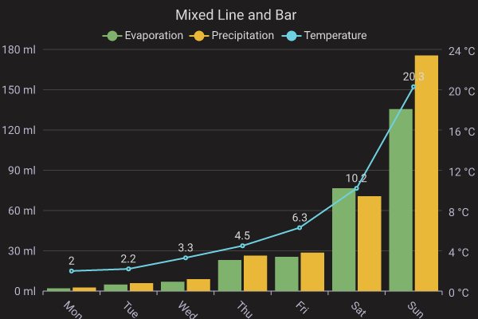
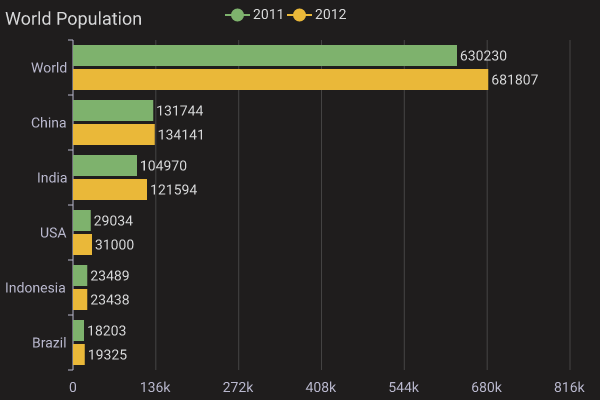
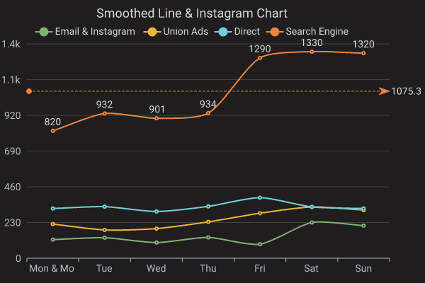
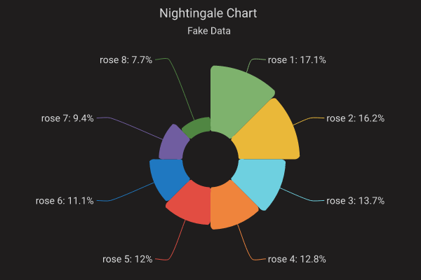
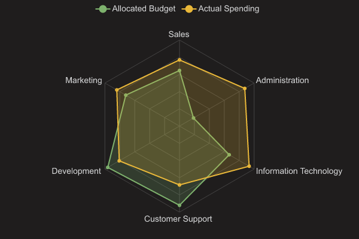
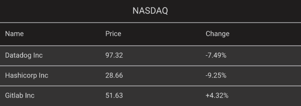

# charts-rs

`charts-rs` is a charting library for rust. It's simple and fast.

[![Crates.io][crates-badge]][crates-url]
[![MIT licensed][apache2-badge]][apache2-url]

[crates-badge]: https://img.shields.io/crates/v/charts-rs.svg
[crates-url]: https://crates.io/crates/charts-rs
[apache2-badge]: https://img.shields.io/badge/license-Apache2-blue.svg
[apache2-url]: https://github.com/vicanso/charts-rs/blob/main/LICENSE

## Overview

`charts-rs` is simpler way for generating charts, which supports `svg` and `png` format and themes: `light`, `dark`, `grafana` and `ant`. The default format is `png` and the default theme is `light`.

`Apache ECharts` is popular among Front-end developers, so `charts-rs` reference it. Developers can generate charts almost the same as `Apache ECharts`. 


## Mix line bar
<p align="center">
    
</p>

## Horizontal bar
<p align="center">
    
</p>

## Line
<p align="center">
    
</p>

## Pie
<p align="center">
    
</p>

## Radar
<p align="center">
    
</p>

## Table
<p align="center">
    
</p>

## Example

```rust,no_run
use charts_rs::{BarChart, svg_to_png};
let bar_chart = BarChart::from_json(
    r###"{
        "width": 630,
        "height": 410,
        "margin": {
            "left": 10,
            "top": 5,
            "right": 10
        },
        "title_text": "Bar Chart",
        "title_font_color": "#345",
        "title_align": "right",
        "sub_title_text": "demo",
        "legend_align": "left",
        "series_list": [
            {
                "name": "Email",
                "label_show": true,
                "data": [120.0, 132.0, 101.0, 134.0, 90.0, 230.0, 210.0]
            },
            {
                "name": "Union Ads",
                "data": [220.0, 182.0, 191.0, 234.0, 290.0, 330.0, 310.0]
            }
        ],
        "x_axis_data": [
            "Mon",
            "Tue",
            "Wed",
            "Thu",
            "Fri",
            "Sat",
            "Sun"
        ]
    }"###,
).unwrap();
println!("{}", bar_chart.svg().unwrap());
svg_to_png(&bar_chart.svg().unwrap()).unwrap();
```

## License

This project is licensed under the [Apache License 2.0 license].

[Apache License 2.0 license]: https://github.com/vicanso/charts-rs/blob/main/LICENSE