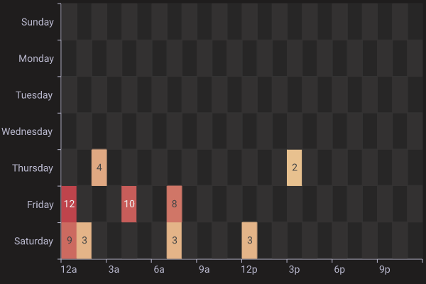

# charts-rs

[中文](./README-zh.md)

`charts-rs` is a charting library for rust. It's simple and fast.

[![Crates.io][crates-badge]][crates-url]
[![MPL licensed][mpl2-badge]][mpl2-url]
[](https://github.com/vicanso/charts-rs/actions/workflows/ci.yml)

[crates-badge]: https://img.shields.io/crates/v/charts-rs.svg
[crates-url]: https://crates.io/crates/charts-rs
[mpl2-badge]: https://img.shields.io/badge/license-mpl2-blue.svg
[mpl2-url]: https://github.com/vicanso/charts-rs/blob/main/LICENSE

## Overview

`charts-rs` provides a straightforward approach to generating charts with support for multiple output formats including `svg`, `png`, `jpeg`, `webp`, and `avif`. The library offers nine distinct themes: `light`, `dark`, `grafana`, `ant`, `vintage`, `walden`, `westeros`, `chalk`, and `shine`, with `light` as the default theme. 

The library supports ten chart types: `Bar`, `HorizontalBar`, `Line`, `Pie`, `Radar`, `Scatter`, `Candlestick`, `Table`, `Heatmap`, and `MultiChart`. Drawing inspiration from `Apache ECharts`, `charts-rs` enables developers to create charts with similar functionality and appearance.

## Themes

[themes](./theme.md)

## Features

- Nine built-in themes available for all chart types
- Custom font loading from ttf or otf files
- Advanced line chart features: smooth curves, area filling, mark points and mark lines
- Multiple legend styles across all charts: `round rect`, `circle`, and `rect`
- Dual y-axis support for enhanced data visualization
- JSON-based chart configuration for simplified setup
- Multiple output formats (svg, png, jpeg, webp, avif) for various use cases
- Web-based JSON editor for interactive chart configuration and testing

## Demo

You can try to use the web demo page, it's simple and useful.

Charts Web Demo Page: [https://charts.npmtrend.com/](https://charts.npmtrend.com/)

Charts Web Source: [https://github.com/vicanso/charts-rs-web](https://github.com/vicanso/charts-rs-web)

<p align="center">
    
</p>

## Mix line bar

<p align="center">
    
</p>

## Horizontal bar

<p align="center">
    
</p>

## Line

<p align="center">
    
</p>

## Pie

<p align="center">
    
</p>

## Radar

<p align="center">
    
</p>

## Scatter

<p align="center">
    
</p>

## Candlestick

<p align="center">
    
</p>

## Table

<p align="center">
    
</p>

## Heatmap

<p align="center">
    
</p>

## Multi Chart

<p align="center">
    
</p>

## Example

### New from option

```rust
use charts_rs::{
    BarChart, Box, SeriesCategory, THEME_GRAFANA
};
let mut bar_chart = BarChart::new_with_theme(
    vec![
        ("Evaporation", vec![2.0, 4.9, 7.0, 23.2, 25.6, 76.7, 135.6]).into(),
        (
            "Precipitation",
            vec![2.6, 5.9, 9.0, 26.4, 28.7, 70.7, 175.6],
        )
            .into(),
        ("Temperature", vec![2.0, 2.2, 3.3, 4.5, 6.3, 10.2, 20.3]).into(),
    ],
    vec![
        "Mon".to_string(),
        "Tue".to_string(),
        "Wed".to_string(),
        "Thu".to_string(),
        "Fri".to_string(),
        "Sat".to_string(),
        "Sun".to_string(),
    ],
****    THEME_GRAFANA,
);
bar_chart.title_text = "Mixed Line and Bar".to_string();
bar_chart.legend_margin = Some(Box {
    top: bar_chart.title_height,
    bottom: 5.0,
    ..Default::default()
});
bar_chart.series_list[2].category = Some(SeriesCategory::Line);
bar_chart.series_list[2].y_axis_index = 1;
bar_chart.series_list[2].label_show = true;

bar_chart
    .y_axis_configs
    .push(bar_chart.y_axis_configs[0].clone());
bar_chart.y_axis_configs[0].axis_formatter = Some("{c} ml".to_string());
bar_chart.y_axis_configs[1].axis_formatter = Some("{c} °C".to_string());

println!("{}", &bar_chart.svg().unwrap());
svg_to_png(&bar_chart.svg().unwrap()).unwrap();
```

### From json

```rust,no_run
use charts_rs::{BarChart, svg_to_png};
let bar_chart = BarChart::from_json(
    r###"{
        "width": 630,
        "height": 410,
        "margin": {
            "left": 10,
            "top": 5,
            "right": 10
        },
        "title_text": "Bar Chart",
        "title_font_color": "#345",
        "title_align": "right",
        "sub_title_text": "demo",
        "legend_align": "left",
        "series_list": [
            {
                "name": "Email",
                "label_show": true,
                "data": [120.0, 132.0, 101.0, 134.0, 90.0, 230.0, 210.0]
            },
            {
                "name": "Union Ads",
                "data": [220.0, 182.0, 191.0, 234.0, 290.0, 330.0, 310.0]
            }
        ],
        "x_axis_data": [
            "Mon",
            "Tue",
            "Wed",
            "Thu",
            "Fri",
            "Sat",
            "Sun"
        ]
    }"###,
).unwrap();
println!("{}", bar_chart.svg().unwrap());
svg_to_png(&bar_chart.svg().unwrap()).unwrap();
```

## Load more fonts

```rust
let buf = fs::read(file).unwrap();
get_or_try_init_fonts(vec![&buf]));
```

## License

This project is licensed under the [MPL-2.0 license].

[MPL-2.0 license]: https://github.com/vicanso/charts-rs/blob/main/LICENSE
